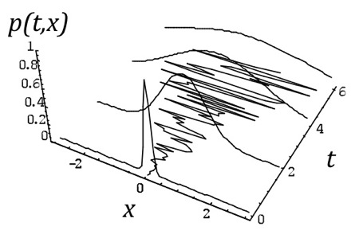

```{r echo=FALSE}
# This removes all items in environment. 
rm(list=ls())
```

\newpage

# Options properties.

Financial options are one of the most flexible, popular and versatile financial instruments. They are relevant by themselves and important as building blocks to create other financial products and financial strategies. In order to fully understand options we need to understand their properties first. This is, what are the determinant of financial options, how these determinants change the option prices, what are the limits of financial options, what happens when these limits are violated, methods for determining the theoretical option prices and the relationship between call and put options.

## Determinants.

The main determinants of option prices are those parameters of the Black-Scholes formula:

-   The price of the underlying stock at time zero: $S_0$.
-   The option strike price: $K$.
-   The risk-free rate: $rf$.
-   The option maturity: $T$.
-   The volatility of the underlying stock $\sigma$.

This is, $BS = f(S_0, K, rf, T, \sigma)$. Here we set up the BS function and then evaluate it at $BS = f(S_0=50, K=50, rf=0.05, T=1, \sigma=0.3)$.

```{r}
library(knitr)
library(kableExtra)
# Black-Scholes call.
c.bs <- function(S, K, rf, TT, sigma) {
  d1 <- (log(S / K) + (rf + sigma^2 / 2) * TT) / (sigma * sqrt(TT))
  d2 <- d1 - sigma * sqrt(TT)
  c <- S * pnorm(d1) - K * exp(-rf * TT) * pnorm(d2)
}
# Black-Scholes put.
p.bs <- function(S, K, rf, TT, sigma) {
  d1 <- (log(S / K) + (rf + sigma^2 / 2) * TT) / (sigma * sqrt(TT))
  d2 <- d1 - sigma * sqrt(TT)
  p <- K * exp(-rf * TT) * pnorm(-d2) - S * pnorm(-d1)
}
# Calculate and report results.
c <- c.bs(50, 50, 0.05, 1, 0.3)
p <- p.bs(50, 50, 0.05, 1, 0.3)
option.prices <- data.frame("call" = c, "put" = p)
row.names(option.prices) <- c("Black-Scholes option prices")
kable(option.prices, caption = "Theoretical option prices.") |>
kable_styling(latex_options = "HOLD_position")
```

Now, let's see how BS changes (call and put) when we leave $S_0$ as a variable and the rest of the parameters as fixed: $BS = f(S_0, K=50, rf=0.05, T=1, \sigma=0.3)$.

```{r}
# Parameters.
K <- 50
rf <- 0.05
TT <- 1
sigma <- 0.3
S0 <- 50
# Sequence of S0.
S0.seq <- seq(from = 0, to = 100, length.out = 50)
# Evaluation of the c.bs and p.bs function.
c.S0 <- mapply(c.bs, S0.seq, K, rf, TT, sigma)
p.S0 <- mapply(p.bs, S0.seq, K, rf, TT, sigma)
```

We produce as many \texttt{c.S0} as values for \texttt{S0.seq}. Then, we can plot.

```{r fig.cap="Call price as a function of the stock price at time zero."}
# See the results.
plot(S0.seq, c.S0, type = "l", lwd = 2, xlab = expression(paste(S[0])), 
     ylab = "Call option price, c")
```

The call option price is an increasing function of $S_0$. This makes sense because a right to buy the stock at a fix price in the future becomes more valuable as the current value of the stock increases. In other words, it is more expensive to lock the price of an expensive asset for a potential buyer.

See the case of the put option.

```{r fig.cap="Put price as a function of the stock price at time zero."}
plot(S0.seq, p.S0, type = "l", lwd = 2, xlab = expression(paste(S[0])), 
     ylab = "Put option price, p")
```

Here, it is cheaper to lock the price of an expensive asset for a potential seller. This makes sense because it looks unnecessary to lock the selling price of an expensive stock.

Let's put both plots together.

```{r fig.cap="Call and put prices as a function of the stock price at time zero (zoom)."}
# What is the interpretation of S0.star, and how did I found this value?
S0.star <- K * exp(-rf * TT)
c.S0.star <- mapply(c.bs, S0.star, K, rf, TT, sigma)
# Plot.
plot(S0.seq, c.S0, type = "l", lwd = 3, col = "blue", ylim = c(4, 8), 
     xlab = expression(paste(S[0])), ylab = "Option theoretical price", 
     xlim = c(40, 55))
lines(S0.seq, p.S0, lwd = 3, col = "red")
abline(v = S0.star, lty = 2)
abline(h = c.S0.star, lty = 2)
abline(h = c, lty = 2, col = "blue")
abline(h = p, lty = 2, col = "red")
abline(v = S0, lty = 2)
points(S0, c, pch = 19, col = "blue", cex = 2)
points(S0, p, pch = 19, col = "red", cex = 2)
points(S0.star, c.S0.star, pch = 19, cex = 2)
legend("topleft", legend = c("Call", "Put"),
       col = c("blue", "red"), lwd = 3, bg = "white")
```

Apparently, there is a single case in which both options (call and put) are the same. It is interesting to find out the value of $S_0$ that makes $c=p$. Clearly, this value is lower than $S_0=50$, the point here is to find the mathematical expression of $S_0$ that makes $c=p$.

## Option bounds.

Option values (or prices) are subject or constrained to upper and lower bounds. This basically mean that in theory option prices cannot exceed upper bounds and cannot decrease below lower bounds. If they do, then arbitrage opportunities arise.

We can extend our analysis by incorporating the corresponding call and put option bounds.

```{r fig.cap="Option values as a function of the stock price at time zero including option bounds."}
# Put lower bound.
lb.put <- pmax(K * exp(-rf * TT) - S0.seq, 0)
# Call lower bound.
lb.call <- pmax(S0.seq - K * exp(-rf * TT), 0)
# Again the S0.star. Where did this value comes from?
line.star <- S0.star * 2
# Plot.
par(pty = "s")
plot(S0.seq, c.S0, type = "l", lwd = 3, col = "blue", ylim = c(0, 100),
     xlab = expression(paste(S[0])), ylab = "Call (blue), put (red)")
lines(S0.seq, p.S0, lwd = 3, col = "red")
abline(v = S0.star, lty = 2) 
abline(v = 0, lty = 2)
abline(v = line.star, lty = 2, col = "green")
abline(h = line.star, lty = 2, col = "green")
# Put upper bound.
abline(h = K * exp(-rf * TT), lwd = 2, col = "red", lty = 2)
lines(S0.seq, lb.put, lwd = 2, col = "red", lty = 2)
# Call upper bound.
lines(S0.seq, S0.seq, lwd = 2, col = "blue", lty = 2) 
lines(S0.seq, lb.call, lwd = 2, col = "blue", lty = 2)
```

Note that the stock price range of values is from zero to positive infinity. However, this is not the case for the options. The option values depend on these bounds. We can illustrate the same plot in a cleaner way, to make emphasis on a geometric approach.

```{r fig.cap="Call and put option bounds: geometric inspection (or 'the puzzle')."}
par(pty = "s")
plot(S0.seq, lb.put, type = "l", lwd = 2, col = "red",  ylim = c(0, 100), 
     xlab = expression(paste(S[0])), ylab = "Call (blue), put (red)")
abline(v = S0.star, lty = 2) 
abline(v = 0, lty = 2)
abline(v = line.star, lty = 2)
abline(h = line.star, lty = 2)
abline(h = S0.star, lwd = 2, col = "red")
lines(S0.seq, S0.seq, lwd = 2, col = "blue")
lines(S0.seq, lb.call, lwd = 2, col = "blue")
# Enumerate the areas.
text(S0.star / 2, (S0.star + (S0.star / 2)), "1")
text(60, 80, "2")
text(80, 60, "3")
text(10, 20, "4")
text(25, 35, "5")
text(25, 10, "6")
text(40, 20, "7")
text(60, 35, "8")
text(80, 20, "9")
```

Every number from 1 to 9 is assigned to a specific geometric shape in the plot above. This is, a square as in 1, and triangles of two different shapes in the rest of the cases (2 to 9). It is interesting to analyze whether each area represents a possible price range for call and/or put options.

Now, let's see how Black-Scholes option prices changes (call and put) when we leave $S_0$ as a variable, three levels of $\sigma$ and the rest of the parameters as fixed: $BS = f(S_0, K=50, rf=0.05, T=1, \sigma)$. We can show this in a 2 dimension plot, including the correspondent bounds.

```{r fig.cap="Call option changes as the stock price at time zero and sigma increases: the role of bounds."}
# Evaluate the function.
c.S0.s1 <- mapply(c.bs, S0.seq, K, rf, TT, sigma)
c.S0.s5 <- mapply(c.bs, S0.seq, K, rf, TT, sigma * 5)
c.S0.s15 <- mapply(c.bs, S0.seq, K, rf, TT, sigma * 15)
# Plot.
plot(S0.seq, c.S0.s1, type= "l", lwd = 3,  xlab = expression(paste(S[0])),
     ylab = "Call option price, c")
lines(S0.seq, c.S0.s5, lwd = 3, col = "blue") # call with higher sigma
lines(S0.seq, c.S0.s15, lwd = 3, col = "red") # call with even higher sigma
lines(S0.seq, lb.call, lwd = 3, lty = 2) # lower bound
lines(S0.seq, S0.seq, lwd = 3, lty = 2) # upper bound
legend("topleft", legend = c("Call sigma=0.3", "Call sigma*5", 
                             "Call sigma*15", "Call bounds"),
       col = c("black", "blue", "red", "black"), lwd = 2,
       lty = c(1, 1, 1, 2), bg = "white", cex = 0.8)
```

And the same for the put option.

```{r fig.cap="Put option changes as the stock price at time zero and sigma increases: the role of bounds."}
# Evaluate the function.
p.S0.s1 <- mapply(p.bs, S0.seq, K, rf, TT, sigma)
p.S0.s5 <- mapply(p.bs, S0.seq, K, rf, TT, sigma * 5)
p.S0.s15 <- mapply(p.bs, S0.seq, K, rf, TT, sigma * 15)
# Plot.
plot(S0.seq, p.S0.s1, type= "l", lwd = 3,  xlab = expression(paste(S[0])),
     ylab = "Pall option price, p")
lines(S0.seq, p.S0.s5, lwd = 3, col = "blue") # put with higher sigma
lines(S0.seq, p.S0.s15, lwd = 3, col = "red") # put with even higher sigma
lines(S0.seq, lb.put, lwd = 3, lty = 2) # lower bound
lines(S0.seq, rep(S0.star, 50) , lwd = 3, lty = 2) # upper bound
legend("bottomleft", legend = c("Put sigma=0.3", "Put sigma*5", 
                             "Put sigma*15", "Put bounds"),
       col = c("black", "blue", "red", "black"), lwd = 2,
       lty = c(1, 1, 1, 2), bg = "white", cex = 0.8)
```

Then, regardless of the extreme value of parameters, option bounds represent the maximum and minimum values for the call and put options. These option prices are theoretical as they are calculated by implementing the Black-Scholes formula. We normally evaluate whether the option *market* prices violates these bounds because this will flag an opportunity to implement an arbitrage strategy to generate a risk-free profit.

A different way to illustrate the option properties is by looking at a plane. Here, we let $S_0$ and $K$ as a free variables and remain the rest as fixed: $BS = f(S_0, K, rf=0.05, T=1, \sigma = 0.3)$.

```{r fig.cap="Call value as the stock price at time zero and the strike price change: a plane view."}
# K as a variable.
K.seq <- S0.seq
# Create the empty matrix.
c.S0.s <- matrix(0, nrow = 50, ncol = 50)
# Fill the empty matrix.
for(i in 1:50){ # Is there an easier way to do this?
  for(j in 1:50){
    c.S0.s[i, j] <- c.bs(S0.seq[i], K.seq[j], rf, TT, sigma) } }
# Plot.
c.S0.s.plot <- persp(S0.seq, K.seq, c.S0.s, zlab = "Call", xlab = "S_0", 
      ylab = "K", theta = -60, phi = 10, expand =  0.5, col = "orange", 
      shade = 0.2, ticktype = "detailed") 
points(trans3d(S0, K, c, c.S0.s.plot), cex = 2, pch = 19, col = "blue")
```

An alternative view is by showing a contour plot. A contour plot is a graphical technique for representing a 3-dimensional surface by plotting constant $z$ slices (option prices), called contours, on a 2-dimensional format. That is, given a value for $z$, lines are drawn for connecting the $(x, y)$ coordinates ($S_0$, $K$) where that $z$ value occurs.

```{r fig.cap="Call value as the stock price at time zero and the strike price change: a contour view."}
contour(S0.seq, K.seq, c.S0.s, xlab = expression(paste(S[0])), ylab = "K", lwd = 2, 
        nlevels = 20)
points(S0, K, pch = 19, col = "blue", cex = 2)
```

Note that the blue circle $(S_0=50, K=50)$ is between the contour line 5 and 10, this makes sense because the call option at $call(S_0=50, K=50, rf=0.05, T=1, \sigma = 0.3) = 7.115627$.

An interesting case is the value of the put as a function of the time to maturity. Let's see the simplest case.

```{r fig.cap="Put value as time to maturity increases: the mysterious hump."}
TT.seq <- seq(from = 1, to = 25, length.out = 50)
p.TT <- mapply(p.bs, S0, K, rf, TT.seq, sigma)
plot(TT.seq, p.TT, type = "l", lwd = 2, ylab = "Put value", xlab = "T")
points(TT, p, col = "red", cex = 2, pch = 19)
```

The put option price first increases as the time to maturity increases and after reaching a maximum, the put option price decreases. What is the mathematical expression for the time to maturity which makes the put option price maximum? What is the reason or logic behind this mysterious hump? Those are interesting questions to address.

Let's illustrate the case when time to maturity and the stock price at time zero changes.

```{r fig.cap="Put value as the stock price at time zero and time to maturity change: a plane."}
p.S0.T <- matrix(0, nrow = 50, ncol = 50)
for(i in 1:50) { # Is there an easier way to do this?
  for(j in 1:50) {
    p.S0.T[i, j] <- p.bs(S0.seq[i], K, rf, TT.seq[j], sigma) } }
p.S0.T.plot <- persp(S0.seq, TT.seq, p.S0.T, zlab = "Put", xlab = "S0", 
               ylab = "T", theta = 330, phi = 10, expand =  0.5, 
               col = "orange", shade = 0.2, ticktype = "detailed") 
points(trans3d(S0, TT, p, p.S0.T.plot), cex = 2, pch = 19, col = "blue")
```

That is not quite clear. So, here is the contour view.

```{r fig.cap="Put value as the stock price at time zero and time to maturity change: a contour view, or the hypnotic plot."}
contour(S0.seq, TT.seq, p.S0.T, xlab = expression(paste(S[0])), ylab = "T", lwd = 2, 
        nlevels = 40, drawlabels = TRUE)
points(S0, TT, pch = 19, col = "blue", cex = 2)
```

Now the mysterious hump is clearer than before. Remember the value of $put(S_0=50, K=50, rf=0.05, T=1, \sigma = 0.3) = 4.677099$.

## Put-call parity.

The main idea behind the put-call parity is to understand how call and put option prices are related as today, at $t=0$. In Hull, the procedure to derive the put-call parity starts with the definition of two portfolios: (1) a call and a bond; (2) a put and a stock. Then, derive the corresponding payoff of each portfolio at maturity. Doing this is relatively easy because we do not need a valuation method as we know the payoff functions for options, bonds and stocks. Given that we can demonstrate that the value of two different portfolios are the same at $T$, then we can conclude that these two portfolios are worth the same at $t=0$ as well. The put-call parity is then: $c+Ke^{-rT}=p+S_0$.

We can verify that this equation holds.

$p=c+Ke^{-rT}-S_0 \rightarrow p=7.115627+50e^{-0.05\times 1}- 50 \rightarrow p=4.677098$.

$c=p+S_0-Ke^{-rT} \rightarrow c=4.677098+50-50e^{-0.05\times 1} \rightarrow c=7.115627$.

Let's take one step back and demonstrate that both portfolios are worth the same at maturity. We first define the assets payoffs.

```{r}
ST.seq <- seq(from = 0, to = 150, length.out = 50)
cT <- pmax(ST.seq - K, 0) # call payoff.
pT <- pmax(K - ST.seq, 0) # put payoff.
BT <- rep(K, 50) # bond payoff (at maturity).
pc <- pmax(ST.seq, K) # this will be important.
```

Then we plot.

```{r fig.cap="Portfolio A and C payoffs: the put-call parity."}
par(pty = "s")
par(mfrow = c(1, 2), oma = c(0, 0, 2, 0))
par(pty = "s")
# Portfolio A.
plot(ST.seq, cT, type = "l", ylab = "Payoff", xlab = expression(paste(S[T])), lwd = 2, 
     lty = 2, col = "blue", ylim = c(0, 150))
lines(ST.seq, BT, lwd = 2, lty = 2, col = "red")
lines(ST.seq, (cT + BT), lwd = 2)
legend("topleft", legend = c("Call option", "Zero coupon bond", 
                           "Total (Portfolio A)"),
       col = c("blue", "red", "black"), lwd = c(2, 2, 2), lty = c(2, 2, 1), 
       bg = "white", cex = 0.7)
par(pty = "s")
# Portfolio C.
plot(ST.seq, ST.seq, type = "l", ylab = "Payoff", xlab = expression(paste(S[T])),
     lwd = 2, lty = 2, col = "orange", ylim = c(0, 150))
lines(ST.seq, pT, lwd = 2, lty = 2, col = "purple")
lines(ST.seq, (pT + ST.seq), lwd = 2)
legend("topleft", legend = c("Put option", "Share", "Total (Portfolio C)"),
       col = c("purple", "orange", "black"), lwd = 2, 
       lty = c(2, 2, 1), bg = "white", cex = 0.7)
```

The point here is that the black line (total) is the same in both cases. This is why we argue that we payoffs of both portfolios are worth the same. If this is so, then they have to value the same in time $t=0$.

In sum, this is the payoff of portfolios A and C: $max(S_T, K)$.

```{r fig.cap="Portfolio A and C payoffs: max(ST,K)."}
par(pty = "s")
plot(ST.seq, pc, type = "l", ylab = "Payoff", xlab = expression(paste(S[T])), lwd = 3, 
     ylim = c(0, 150))
```

Nice. We can manipulate the put-call parity to create a synthetic stock. This is:

$c+Ke^{-rT}=p+S_0 \rightarrow S_0 = c+Ke^{-rT}-p$.

Graphically:

```{r fig.cap="A synthetic stock."}
par(pty = "s")
plot(ST.seq, (cT + BT - pT), type = "l", ylab = "Payoff", xlab = expression(paste(S[T])), 
     lwd = 3, ylim = c(-50, 150), xlim = c(0, 200), col = "orange")
lines(ST.seq, cT, lwd = 2, lty = 2, col = "blue") # positive call.
lines(ST.seq, BT, lwd = 2, lty = 2, col = "red") # positive bond.
lines(ST.seq, -pT, lwd = 2, lty = 2, col = "purple") # negative put.
legend("bottomright", legend = c("Call option", "Zero coupon bond", 
                               "Put option", "Total (stock)"),
       col = c("blue", "red", "purple", "orange"), lwd = 2, 
       lty = c(2, 2, 2, 1), bg = "white", cex = 0.65)
```

So, we created a stock that did not exist with a call, a bond and a put.

We can manipulate the put-call parity to create a synthetic bond. This is:

$c+Ke^{-rT}=p+S_0 \rightarrow Ke^{-rT} = p+S_0-c$.

Graphically:

```{r fig.cap="A synthetic bond."}
par(pty = "s")
plot(ST.seq, (-cT + ST.seq + pT), type = "l", ylab = "Payoff", xlab = expression(paste(S[T])), 
     lwd = 3, ylim = c(-50, 150), xlim = c(0, 200), col = "orange",
     main = "A synthetic bond.")
lines(ST.seq, -cT, lwd = 2, lty = 2, col = "blue") 
lines(ST.seq, ST.seq, lwd = 2, lty = 2, col = "red") 
lines(ST.seq, pT, lwd = 2, lty = 2, col = "purple") 
legend("bottomright", legend = c("Call option (short)", "Stock", 
                               "Put option", "Total (bond)"),
       col = c("blue", "red", "purple", "orange"), lwd = 2, 
       lty = c(2, 2, 2, 1), bg = "white")
```

There is an alternative to the Black-Scholes formula we indirectly review before. Next section introduces the binomial trees.

```{r eval=FALSE, include=FALSE}
ST.seq <- seq(from = 0, to = 60, length.out = 200)
K = 30
c = 3
p = 2.25
S0 = 31
r = 0.1
TT = 1
cl <- pmax(ST.seq - K, 0) - c # long call payoff.
pl <- pmax(K - ST.seq, 0) - p # long put payoff.
cs <- pmin(K - ST.seq, 0) + c # short call payoff.
ps <- pmin(ST.seq - K, 0) + c # short put payoff.

plot(ST.seq, cl, type = "l", ylim = c(-10,40))
abline(h = 0, lty = 2)
abline(v = K, lty = 2)
lines(ST.seq, ps)
lines(ST.seq, -ST.seq + S0)
lines(ST.seq, rep((S0+p-c)*exp(r*TT), 200))

cl+cs-(ST.seq + S0)+(S0+p-c)*exp(r*TT)

cl+ps-(ST.seq+S0)
```

# Binomial trees.

Binomial trees are a flexible valuation method for options because we can use them to value not only European but also American options.

## Implementation.

The function is the following.

```{r}
bin <- function(S0, K, sigma, TM, r, steps) {
# the parameters
dt <- TM / steps
u <- exp(sigma * sqrt(dt))
d <- exp(-sigma * sqrt(dt))
a <- exp(r * dt)
p <- (a - d) / (u - d)
S <- matrix(0, steps + 1, steps)
pam <- S
peu <- S
cam <- S
ceu <- S
# the stock price process
  for(i in 1:steps) {
    j <- i + 1
    do <- seq(0, i)
    up <- rev(do)
    S[(1:j), i] <- S0 * (u ^ up) * (d ^ do) }
# the option prices at maturity.
peu[(1:(steps + 1)), steps] <- pmax(K - S[, i], 0)
pam[(1:(steps + 1)), steps] <- pmax(K - S[, i], 0)
ceu[(1:(steps + 1)), steps] <- pmax(S[, i] - K, 0)
cam[(1:(steps + 1)), steps] <- pmax(S[, i] - K, 0)
# the binomial method to price stock options.
for(j in steps:1) { # this is a reverse loop from steps to 1.
  cd <- (seq(steps:1)) # every round we compute less option prices.
  for(i in 1:cd[j]) { # option prices per step.
    peu[i, (j - 1)] <- exp(-r * dt) * (p * peu[i, j] + 
                                       (1 - p) * peu[(i + 1), j])
    ceu[i, (j - 1)] <- exp(-r * dt) * (p * ceu[i, j] + 
                                       (1 - p) * ceu[(i + 1), j])
    pam[i, (j - 1)] <- max((K - S[i, (j - 1)]), exp(-r * dt) * 
                           (p * pam[i, j] + (1 - p) * pam[(i + 1), j]))
    cam[i, (j - 1)] <- max((S[i, (j - 1)] - K), exp(-r * dt) * 
                           (p * cam[i, j] + (1 - p) * cam[(i + 1), j])) } }
# This is the final step in the binomial tree.
p.eu <- exp(-r * dt) * (p * peu[1, 1] + (1 - p) * peu[2, 1])
c.eu <- exp(-r * dt) * (p * ceu[1, 1] + (1 - p) * ceu[2, 1])
p.am <- exp(-r * dt) * (p * pam[1, 1] + (1 - p) * pam[2, 1])
c.am <- exp(-r * dt) * (p * cam[1, 1] + (1 - p) * cam[2, 1])
# Results.
option <- data.frame(c.eu, p.eu, c.am, p.am)
option
}
```

We can evaluate the function to see how the price change depending on the number of steps in the binomial tree.

```{r}
b1t <- bin(S0, K, sigma, TT, rf, 1)
b4t <- bin(S0, K, sigma, TT, rf, 4)
b20t <- bin(S0, K, sigma, TT, rf, 20)
b50t <- bin(S0, K, sigma, TT, rf, 50)
b200t <- bin(S0, K, sigma, TT, rf, 200)
b500t <- bin(S0, K, sigma, TT, rf, 500)
```

See the results.

```{r}
Black.Scholes <- data.frame(c.eu = c, p.eu = p, c.am = NA, p.am = NA)
bin.bs <- rbind("Binomial (1 step)" = b1t, "Binomial (4 steps)" = b4t,
                "Binomial (20 steps)" = b20t, "Binomial (50 steps)" = b50t,
                "Binomial (200 steps)" = b200t, 
                "Binomial (500 steps)" = b500t, 
                "Black-Scholes" = Black.Scholes)
kable(bin.bs, caption = "Binomial and Black-Scholes comparison.") |>
kable_styling(latex_options = "HOLD_position")
```

In the extreme, the binomial method converges to the Black-Scholes method. Let's explore these differences.

```{r}
b1 <- mapply(bin, S0.seq, K, sigma, TT, rf, 1)
b2 <- mapply(bin, S0.seq, K, sigma, TT, rf, 2)
b3 <- mapply(bin, S0.seq, K, sigma, TT, rf, 3)
b4 <- mapply(bin, S0.seq, K, sigma, TT, rf, 4)
b20 <- mapply(bin, S0.seq, K, sigma, TT, rf, 20)
```

Here we compare the value of the binomial method and the Black-Scholes as a function of $S_0$.

```{r fig.cap="Binomial and Black-Scholes comparison."}
plot(S0.seq, b1[1, ], type = "l", col = "red", lwd = 2, xlab = expression(paste(S[0])), 
     ylab = "Call")
lines(S0.seq, c.S0.s1, col = "black", lwd = 2)
legend("topleft", legend = c("1 step binomial", "Black-Scholes"),
       col = c("red", "black"), lwd = 2, bg = "white")
```

There are some differences between the binomial and the Black-Scholes. Let's zoom to see the differences clearer.

```{r fig.cap="Binomial and Black-Scholes convergence: a zoom view."}
plot(S0.seq, b1[1,], type="l", ylim = c(0, 4), xlim = c(30, 45), 
     col = "green", lwd = 2, xlab = expression(paste(S[0])), ylab = "Call")
lines(S0.seq, b2[1,], col = "purple", lwd = 2)
lines(S0.seq, b3[1,], col = "orange", lwd = 2)
lines(S0.seq, b4[1,], col = "red", lwd = 2)
lines(S0.seq, b20[1,], col = "black", lwd = 2)
lines(S0.seq, c.S0.s1, col = "black", lwd = 2)
legend("topleft", legend = c("1 step binomial", "2 steps binomial", 
                             "3 steps binomial", "4 steps binomial",
                             "10 steps binomial", "Black-Scholes"),
       col = c("green", "purple", "orange", "red", "black", "black"), 
       lwd = 2, bg = "white")
```

As stated above, the binomial method converges to the Black-Scholes. We can also create a function to visualize the price path of the stock given the assumptions of the binomial method.

## Stock price paths.

In order to value option prices, we first need to understand the evolution of the underlying (in this case the stock price) first. The binomial method assumes that the price can increase or decrease with a certain probability in each time step. Here, we can show how the binomial tree method assumes this stock price evolution.

```{r}
# Function to generate stock prices paths given the binomial method.
S.paths <- function(S0, sigma, TM, steps) {
  dt <- TM / steps
  u <- exp(sigma * dt^0.5) # Here we set u and d as a function of sigma.
  d <- exp(-sigma * dt^0.5)
  S <- matrix(0, (steps + 1), (steps + 1))
  S[1, 1] <- S0
  for(i in 2:(steps + 1)) {
    do = seq(0, i - 1)
    up = rev(do) # rev provides a reversed version of its argument. 
    S[(1:i), i] = S0 * (u ^ up) * (d ^ do) }
  S }
# Evaluate the function.
Spaths <- S.paths(50, 0.3, 1, 10)
# A table.
colnames(Spaths) <- c(0, cumsum(rep(1/10, 10)))
kable(Spaths, caption = "Stock price paths given to the binomial model.",
      digits = 2) |>
kable_styling(latex_options = "HOLD_position")
```

This does not look like a typical binomial tree. In fact, it is not very clear whether a given price corresponds to an increase or decrease. We can make a few arrangements to visualize this as a tree.

```{r}
S.paths <- function(S0, sigma, TM, steps) {
  dt <- TM / steps
  u <- exp(sigma * dt^0.5)
  d <- exp(-sigma * dt^0.5)
  S <- matrix(0, 2 * ((steps + 1)), (steps + 1))
  S2 <- matrix(NA, ((2 * steps) + 2), (steps + 1))
  S2[(steps + 1), 1] <- S0
  for(i in 2:(steps + 1)) {
    do = seq(0, i - 1)
    up = rev(do) # rev provides a reversed version of its argument. 
    S[(1:i), i] = S0 * (u ^ up) * (d ^ do)
    x = rep(NA, i) # These are the NA between stock prices.
    r = rev(c(seq(0, (steps - 1)), 0)) # These creates the blank spaces.
    # Here we combine NA and stock prices for each column.
    S2[(1 + r[i]):((2 * i) + r[i]), i] = as.numeric(rbind(S[(1:i), i], x))
    }
  S2 }
# Evaluate the function.
Spaths <- S.paths(50, 0.3, 1, 10)
# A table.
colnames(Spaths) <- round(c(0, cumsum(rep(1/10, 10))), 2)
kable(Spaths, caption = "Stock price paths given to the binomial model.",
      digits = 2) |>
kable_styling(latex_options = "HOLD_position")
```

Nice.

```{r}
# Evaluate the function.
# bin <- function(S0, K, sigma, TM, r, steps) {

b2 <- mapply(bin, 50, 52, 0.3, 2, 0.05, 2)
b2
```

```{r}
# E2 Q1
# the value of being American; or the cost of being European.
S.seq <- seq(30, 70, 0.5)
AEoptions <- mapply(bin, S.seq, 52, 0.3, 1, 0.05, 50)
plot(S.seq, unlist(AEoptions[4,]) - unlist(AEoptions[2,]), type = "l", lwd = 2,
     main = "The value of being American.",
     xlab = expression(paste(S[0])),
     ylab = "Option premium for American put options.")
abline(v = 52, lty = 2)
```

```{r}
# Risk neutral probability, note that r is the risk-free rate.
# This is the substitution of equation 13.3.
p.12 <- (exp(0.12*(3/12))-0.9)/(1.1-0.9)
p.12
```

```{r}
# Option expected value ($) at time T
option_T <- p.12*1 + (1-p.12)*0
option_T
```

```{r}
# Option value ($) at time 0.
# This option value is valid for the real world, not only the risk-neutral world.
option_0 <- option_T * exp(-0.12*(3/12))
option_0
```

```{r}
# Real world probability.
# Suppose that, in the real world, the expected return on the stock is 16%
p.real <- (exp(0.16*(3/12))-0.9)/(1.1-0.9)
p.real
```

```{r}
# The expected payoff ($) from the option in the real world is then:
option_T_real <- p.real*1 + (1-p.real)*0
option_T_real
```

Can we calculate the present value of \$0.7040539? We only need the option discount factor. The problem is that we do not know this rate. It is not easy to know the correct discount rate of the option to apply to the expected payoff in the real world. Using risk-neutral valuation solves this problem because we know that in a risk-neutral world the expected return on all assets (and therefore the discount rate to use for all expected payoffs) is the risk-free rate.

What can we do to find out the option discount factor? Since we know the correct value of the option is 0.6329951, we can deduce that the correct real-world discount rate is 42.55688%. This is because $0.6329951 = 0.704053e^{-0.4255688\times3/12}$.

To solve for the real-world option discount rate we do the following: $r=-log(0.6329951 / 0.704053)\times (12/3)$.

```{r}
# Real world option discount factor:
option.df <- -log(option_0/option_T_real)*(12/3)
option.df
```

The correct real-world discount rate for the option is 42.55688%.

```{r}
# Put everything in a function.
option.df.fun <- function(r) {
  p.real <- (exp(r*(3/12))-0.9)/(1.1-0.9)
  option_T_real <- p.real*1 + (1-p.real)*0
  option.df <- -log(option_0/option_T_real)*(12/3)
option.df
}
```

```{r}
# Evaluate for known values:
option.df.fun(0.12)
option.df.fun(0.16)
```

Everything looks correct.

```{r}
# Evaluate the function in a range of values.
r.seq <- seq(0.11, 0.17, 0.001)
df <- mapply(option.df.fun, r.seq)
par(pty = "s")
plot(r.seq, df, type = "l", lwd = 2,
     main = "Options are in general much risker compared with the 
     underlying stock.",
     xlab = "Expected return of the stock (the underlying)",
     ylab = "Expected return of the option")
abline(v = 0.12, lty = 2, col = "blue")
abline(h = option.df.fun(0.12), lty = 2, col = "blue")
abline(v = 0.16, lty = 2, col = "red")
abline(h = option.df.fun(0.16), lty = 2, col = "red")
```

## Parrondo's Paradox: Combine two losing investments into a winner.

Consider asset A which has 6% gross return. In the context of a binomial tree: $p\times(1+u)+(1-p)\times(1-d)=1.06$. Let's assume $p=0.5$, so we have: $0.5(1+u)+0.5(1-d)=1.06$. Asset A has 40% volatility, so $0.4=\sqrt{0.5(1+u)^2+0.5(1-d)^2-1.06^2}$. Solving for $(1+u)$ and $(1-d)$ leads to $(1+u)=1.46$ and $(1-d)=0.66$.

In a period of 5 years, we would have a random path of ups (1.46) and downs (0.66).

```{r}
u = 0.46
d = 0.34
set.seed(2, sample.kind="Rounding")
a <- sample(c(1+u, 1-d), 5, replace = TRUE)
a
```

The evolution of \$1 dollar invested in this 5 year period would look like this:

```{r}
cumprod(a)
```

Even simpler, a $\$1$ dollar invested at $t=0$ would lead to $\$0.6128265$ at $T=5$.

```{r}
prod(a)
```

Let's use a function now.

```{r}
binomial_tree <- function(u, d, n) {
  prod(sample(c(1+u, 1-d), n, replace = TRUE))
}
```

See if it works.

```{r}
set.seed(2, sample.kind="Rounding")
binomial_tree(u = 0.46, d = 0.34, n = 5)
set.seed(2, sample.kind="Rounding")
binomial_tree(u = 0.46, d = 0.34, n = 30)
```

It works, a $\$1$ dollar invested at $t=0$ would lead to $\$0.6128265$ at $T=5$. And now we know that a $\$1$ dollar invested at $t=0$ would lead at $T=30$. Let's view the 30 year case:

```{r}
library(ggplot2)
library(tidyr)
library(dplyr)
u = 0.46
d = 0.34
n = 30
set.seed(2, sample.kind="Rounding")
a.30 <- cumprod(sample(c(1+u, 1-d), n, replace = TRUE))
a.30 <- as.data.frame(cbind(year = c(1:30), ret = a.30))
  ggplot(a.30, aes(x = year, y = ret)) +
  geom_line(size = 1) +
      labs(y = "$",
       x = "Year",
       title = "Cumulative return asset A.",
       subtitle = "Evolution of $1 invested in year 0.")
```

These results represent one single path. So, if we are interested in the most likely value of our investment we need to simulate many paths and then estimate the median. Let's consider we simulate 10000 paths and see the most likely value of our investment.

```{r}
u = 0.46
d = 0.34
n = 30
set.seed(2, sample.kind="Rounding")
a.30x10k <- replicate(10000, 
                      cumprod(sample(c(1+u, 1-d), n, replace = TRUE))) |>
  as.data.frame() |>
  mutate(year = c(1:30)) |>
  gather(V1:V10000, key = name, value = c.ret)
```

See the results.

```{r}
a.30x10k |>
ggplot(aes(x = year, y = c.ret, color = name)) +
  geom_line(size = 1) +
  theme(legend.position = "none", legend.title = element_blank()) +
  labs(y = "$",
       x = "Year",
       title = "Cumulative return asset A.",
       subtitle = "10,000 paths of the evolution of $1 invested in year 0.")
```

Note the plot is highly concentrated at low values. It is easier to show the results in logarithm form.

```{r}
a.30x10k |>
ggplot(aes(x = year, y = c.ret, color = name)) +
  geom_line(size = 1) +
  theme(legend.position = "none", legend.title = element_blank()) +
  labs(y = "Log10 cumulative returns",
       x = "Year",
       title = "Log10 cumulative return asset A.",
       subtitle = "10,000 paths of the evolution of $1 invested in year 0.") +
  scale_y_log10()
```

Here it is easier to see that the paths actually follow a binomial structure. Now, let's see the summary statistics for the 10,000 possible investment value at year 30.

```{r}
set.seed(2, sample.kind = "Rounding")
summary(replicate(10000, binomial_tree(u = 0.46, d = 0.34, 30)))
```

Not good news as our 30 year investment of $\$1$ in this asset A with 6% gross return and 40% volatility leads to $\$0.5733923$. Even if we drop the set.seed, we end with the same result.

```{r}
median(replicate(10000, binomial_tree(u = 0.46, d = 0.34, 30)))
```

It would be a mistake to consider the mean as the maximum value is very high and not likely to happen. The asset A is then a loosing investment, $\$1$ would most likely lead to $\$0.5733923$.

Now, let's consider an asset B. Asset B has an excess return of $-0.1\%$. In the context of a binomial tree: $0.5(1+u)+0.5(1-d)=0.999$. Asset B has no volatility, imagine is a Treasury Bill or a similar risk-free asset. Solving for $(1+u)$ and $(1-d)$ leads to $(1+u)=0.999$ and $(1-d)=0.999$. Asset B is for sure a loosing investment as well.

In a period of 5 years, we would have a random path of ups and downs in the context of a binomial path. Although in this case the result is the same as we have no risk.

```{r}
b <- sample(c(1+(-0.001), 1-(0.001)), 5, replace = TRUE)
b
```

The evolution of \$1 dollar invested in this 5 year period would look like this:

```{r}
cumprod(b)
```

Or simply:

```{r}
prod(b)
```

As stated earlier, this asset B is a loosing investment. Let's verify this for 5 and 30 years as we did before for the case of asset A:

```{r}
binomial_tree <- function(u, d, n) {
  prod(sample(c(1+u, 1-d), n, replace = TRUE))
}
set.seed(2, sample.kind="Rounding")
binomial_tree(u = (-0.001), d = (0.001), 5)
binomial_tree(u = (-0.001), d = (0.001), 30)
```

It works, a $\$1$ dollar invested at $t=0$ would lead to $\$0.99501$ at $T=5$. And now we know that a $\$1$ dollar invested at $t=0$ would lead to $\$0.970431$ at $T=30$. These results represent one single path, but we do not need more as there is no risk. Let's confirm:

```{r}
set.seed(2, sample.kind = "Rounding")
median(replicate(10000, binomial_tree(u = -0.001, d = 0.001, 30)))
```

The result is the same. Asset B is a loosing investment as well. But, what if we combine both assets A and B in an equally weighted portfolio C?

```{r}
set.seed(2, sample.kind = "Rounding")
median(replicate(1, binomial_tree(u = (0.46-0.001)/2, 
                                      d = (0.34+0.001)/2, 30)))
```

This is how we combine two losing investments into a winner.

The new asset C or portfolio C has a return of: $0.06/2 - 0.001/2=0.0295%$ or $2.95\%$. The volatility of C is $\sqrt{0.5^2(0.4)^2+0.5^2(0)^2-0}=0.2$ or $20\%$. Therefore, portfolio C has a lower return and risk than A. Given that A and B are uncorrelated, the diversification gain is high so we can combine two losing investments into a winner.

Let's visualize how these assets behave. I have to set the seed to have nice results. But as we show before this works well when simulating many paths and computing the median to evaluate the expected cumulative return of each asset.

```{r}
u = 0.46
d = 0.34
xx = 8
set.seed(xx, sample.kind="Rounding")
a30 <- sample(c(1+u, 1-d), 30, replace = TRUE)
u = - 0.001
d = 0.001
b30 <- sample(c(1+u, 1-d), 30, replace = TRUE)
u = (0.46 - 0.001)/2
d = (0.34 + 0.001)/2
set.seed(xx, sample.kind = "Rounding")
c30 <- sample(c(1+u, 1-d), 30, replace = TRUE)
```

Below, it is clear that asset C wins less when asset A wins. Similarly, asset C looses less when asset A losses. This is because asset C is less risky than asset A.

```{r}
abc <- as.data.frame(cbind(
  year = c(1:30), a = cumprod(a30), b = cumprod(b30), c = cumprod(c30)))
abc
```

```{r}
abc |>
  gather(a:c, key = name, value = c.ret) |>
  ggplot(aes(x = year, y = c.ret, color = name)) +
  geom_line(size = 1)
```

```{r}
set.seed(2, sample.kind = "Rounding")
ax <- (replicate(10000, binomial_tree(u = -0.001, d = 0.001, 30)))
set.seed(2, sample.kind = "Rounding")
cx <- (replicate(10000, binomial_tree(u = (0.46-0.001)/2, 
                                      d = (0.34+0.001)/2, 30)))
set.seed(2, sample.kind = "Rounding")
bx <-(replicate(10000, binomial_tree(u = 0.46, d = 0.34, 30)))

abcx <- as.data.frame(cbind(
  year = c(1:30), a = ax, b = bx, c = cx))

abcx |>
  gather(a:c, key = name, value = c.ret) |>
  ggplot(aes(x = name, y = log(c.ret), color = name)) +
  geom_boxplot() +
  theme(legend.position = "none")
  #geom_hline(yintercept = 0, linetype = "longdash")

```

Stock price paths are useful to value option stocks. Let's review some stochastic processes in the next section.

# Wiener processes.

Here we review stochastic process that are useful in finance, especially in the Black-Scholes context.

## The basic process.

A simple Wiener process.

```{r}
rm(list=ls()) #Removes all items in Environment!
# A typical Wiener process.
TT <- 5
N <- 10000
dt <- TT / N
Time <- seq(from = dt, to = TT, by = dt)
set.seed(560746) # for reproducibility purposes.
delta_z <- rnorm(N, 0, 1) * dt^0.5 
z <- 25 + cumsum(delta_z) # The initial price is 25.
```

Graphically:

```{r fig.cap="Wiener process 10,000 steps from blue z(0)=25 to z(T)=26.2 in red."}
plot(Time, z, type = "l",
     ylab = "z in the texbook, it could be a stock price",
     xlab = "Time, this could be 5 days or even shorter periods")
lines(Time, seq(25, (25 + sum(delta_z)), length.out = N), lty = 2,
      col = "purple")
points(Time[1], 25, col = "blue", cex = 2, pch = 16)
points(Time[N], z[N], col = "red", cex = 2, pch = 16)
legend("topleft", legend = c(round(z[N], 2)), bg = "white", 
       text.col = "red")
```

This is supposed to mimic the evolution of a stock price. Now, we propose to produce not only one but 100 processes.

```{r}
# 100 Wiener processes.
set.seed(365633)
mat.delta_z <- matrix(rnorm(100 * N, mean = 0, sd = 1), 100, N) 
mat.z1 <- 25 + t(apply(mat.delta_z, 1, cumsum)) 
mat.z <- t(cbind(matrix(25, 100), mat.z1))
Time2 <- c(0, Time)
pred <- mean(mat.z[(N + 1), ])
# 95% range.
rangetop <- pred + qnorm(0.975) * var(mat.z[(N + 1), ])^0.5
rangedown <- pred - qnorm(0.975) * var(mat.z[(N + 1), ])^0.5
```

Graphically.

```{r fig.cap="100 Wiener process 10,000 steps, initial price at 25, red is the mean at T."}
matplot(Time2, mat.z, type = "l", lty = 1, col = rgb(0, 0, 1, 0.3),
     ylab = "z in the texbook, it could be a stock price",
     xlab = "Time")
abline(h = pred, lty = 2, col = "red")
abline(v = 0, lty = 2)
lines(Time2, seq(25, pred, length.out = N + 1), lty = 2)
points(Time2[N + 1], pred, col = "red", cex = 2, pch = 16)
points(0, 25, col = "black", cex = 2, pch = 16)
legend("topleft", legend = c(round(pred, 2)), bg = "white", 
       text.col = "red")
abline(h = rangetop, lty = 2)
abline(h = rangedown, lty = 2)
```

Let's confirm this 95% confidence interval.

```{r}
sum(mat.z[(N + 1), ] > rangetop)
sum(mat.z[(N + 1), ] < rangedown)
```

This means that 5 values are outside this 95% confidence interval. Confidence intervals are then correct.

```{r}
summary(mat.z[(N + 1), ])
```

A potential problem is that the values can be negative. This is problematic when we are interested to model stock prices.

Let's explore deeper the stochastic process below.

```{r fig.cap="A stochastic process."}
set.seed(1)
delta_z <- rnorm(N, 0, 1) * dt^0.5 
z <- 25 + cumsum(delta_z)
### A stochastic process
par(mfrow = c(2, 2), mai = c(0.4, 0.4, 0.4, 0.4))
par(pty = "s")
plot(Time, z, type = "l", xlim = c(0, TT), ylim = c(22.5, 26),
     main = "z", ylab = "")
plot(Time, delta_z, type = "h", xlim = c(0, TT),
     main = "delta_z", ylab = "")
abline(h = 0, lty = 2, col = "orange", lwd = 2)
plot(Time, z, type = "l", xlim = c(0, 1/12), ylim = c(24.9, 25.35),
     main = "z (first month only)", ylab = "")
plot(Time, delta_z, type = "h", xlim = c(0, 1/12), 
     col = ifelse(delta_z < 0, "red", "blue"), ylim = c(-0.055, 0.055),
     main = "delta_z (first month only)", ylab = "")
```

These processes are driven by a random component. The lower panel is revealing because we can see how the random component goes from positive to negative without any pattern, it is entirely random. Now, let's explore the role of $\Delta t$.

```{r fig.cap="Wiener process."}
par(mfrow=c(2, 2), mai = c(0.4, 0.4, 0.4, 0.4))
par(pty = "s")
plot(Time[(seq(from = 1, to = N, length.out = 10))],
     z[(seq(from = 1, to = N, length.out = 10))], type = "l",
     ylim = c(22.5, 26), main = "Relatively large value of delta_t",
     ylab = "")
abline(v = 0, lty = 2)
abline(v = 5, lty = 2)
plot(Time[(seq(from = 1, to = N, length.out = 100))],
     z[(seq(from = 1, to = N, length.out = 100))], type = "l", 
     ylim = c(22.5, 26), ylab = "z", main = "Smaller value of delta_t")
abline(v = 0, lty = 2)
abline(v = 5 , lty = 2)
plot(Time[(seq(from = 1, to = N, length.out = 1000))],
     z[(seq(from = 1, to = N, length.out = 1000))], type = "l", 
     ylim = c(22.5, 26), ylab = "z", main = "Smaller value of delta_t")
abline(v = 0, lty = 2)
abline(v = 5 , lty = 2)
plot(Time, z, type = "l", ylim = c(22.5, 26), # length 10,000
     main = "True process as delta_t tends to 0")
abline(v = 0, lty = 2)
abline(v = 5, lty = 2)
```

The $\Delta t$ value determines how frequent are the changes.

A few properties of stochastic processes.

```{r}
mean(delta_z) # should be zero
var(delta_z)^0.5 # should be dt^.5
dt^0.5
var(delta_z) # should be dt
dt
```

## The generalized Wiener process.

Now let's analyze the case of the generalized Wiener process.

```{r}
# Figure 14.2
TT <- 50
N <- 200
dt <- TT / N
Time <- seq(from = 0, to = TT, by = dt)
set.seed(123)
delta_z <- 1.5 * rnorm(N, 0, 1) * dt^0.5
delta_x <- (0.3 * dt) + delta_z
x <- c(0, cumsum(delta_x))
z <- c(0, cumsum(delta_z))
```

Graphically:

```{r fig.cap="In Hull: Figure 14.2"}
plot(Time, x, type = "l", lwd = 2, ylim = c(-7, 22))
lines(Time, z, col = "red", lwd = 2)
lines(Time, 0.3 * Time, col = "blue", lwd = 2)
abline(0, 0)
abline(v = 0)
legend("topleft", legend = c("Generalized Wiener process", 
                             "Drift", "Basic Wiener process"),
       col = c("black", "blue", "red"), lwd = 3, bg = "white", cex = 0.8)
```

Here, the generalized Wiener process is decomposed into the drift and the basic Wiener process. A zoom of the same plot.

```{r fig.cap="In Hull: Figure 14.2 (zoom)"}
# Figure 14.2 Zoom
plot(Time, x, type = "b", ylim = c(-0.6, 1), xlim = c(0, 1), lwd = 2)
lines(Time, z, col = "red", lwd = 2, type = "b")
lines(Time, 0.3 * Time, col = "blue", lwd = 2, type = "b")
abline(0, 0)
abline(v = 0)
abline(v = dt, lty = 2)
abline(v = dt * 2, lty = 2)
abline(v = dt * 3, lty = 2)
abline(v = dt * 4, lty = 2)
points(dt, 0, pch = 1, col = "blue", lwd = 2)
points(dt * 2, 0, pch = 1, col = "blue", lwd = 2)
points(dt * 3, 0, pch = 1, col = "blue", lwd = 2)
points(dt * 4, 0, pch = 1, col = "blue", lwd = 2)
legend("topleft", legend = c("Generalized Wiener process", 
                           "Drift", "Basic Wiener process"),
       col = c("black", "blue", "red"), lty = 1, bg = "white", lwd = 2)
```

This is a nice visual representation of: generalized = drift + Wiener.

See how the process changes when we consider a lower value of $a$.

```{r fig.cap="Generalized Wiener process: lower a"}
set.seed(123)
delta_xlow <- (0.15 * dt) + delta_z
xlow <- c(0, cumsum(delta_xlow))
# Now plot.
plot(Time, xlow, type = "l", ylim = c(-7, 22), lwd = 2, ylab = "x")
lines(Time, x, lwd = 2, col = "grey")
lines(Time, z, lwd = 2, col = "red")
lines(Time, 0.15 * Time, lty = 2, lwd = 2)
lines(Time, 0.3 * Time, lty = 2, lwd = 2, col = "grey")
abline(0, 0)
abline(v = 0)
legend("topleft", legend = c("Original generalized Wiener process", 
    "Original drift", "New generalized Wiener process", "New drift",
    "Basic Wiener process"), lty = c(1, 2, 1, 2, 1), bg = "white", lwd = 2,
     col = c("grey", "grey", "black", "black", "red"), cex = 0.7)
```

And a higher value of $b$.

```{r fig.cap="Generalized Wiener process: higher b"}
set.seed(123)
delta_zhigh <- 3 * rnorm(N, 0, 1) * dt^0.5
delta_xhigh <- (0.3 * dt) + delta_zhigh
xhigh <- c(0, cumsum(delta_xhigh))
zhigh <- c(0, cumsum(delta_zhigh))
plot(Time, xhigh, type = "l", ylim = c(-7, 22), lwd = 2, ylab = "x")
lines(Time, x, lwd = 2, col = "grey")
lines(Time, zhigh, lwd = 2, col = "red")
lines(Time, z, lwd = 2, col = "grey")
lines(Time, 0.3 * Time, lty = 2, lwd = 2)
abline(0, 0)
abline(v = 0)
legend("topleft", legend = c("New generalized Wiener process", 
      "Original generalized Wiener process", "Drift" ,
      "New basic Wiener process", "Original basic Wiener process"), 
      lty = c(1, 1, 2, 1, 1), bg = "white", lwd = 2,
       col = c("black", "grey", "black", "red", "grey"), cex = 0.7)
```

Note the changes are now more pronounced.

```{r}
# Table 14.1
set.seed(19256)
delta_S <- rep(0, 10)
S <- rep(100, 10)
epsilon <- rep(0, 10)
for(i in 1:10){
  epsilon[i] <- rnorm(1, 0, 1)
  delta_S[i] <- 0.15 * (1 / 52) * S[i] + 0.3 * ((1 / 52)^0.5) * 
    epsilon[i] * S[i]
  S[i+1] <- S[i] + delta_S[i]
}
epsilon <- c(epsilon, NA)
delta_S <- c(delta_S, NA)
results <- data.frame(S, epsilon, delta_S)
kable(results, caption = "Simulation of stock price (Table 14.1 in Hull).", 
      digits = 4) |>
kable_styling(latex_options = "HOLD_position")
```

It is interesting to note that in Hull the final simulated price is 111.54 and here it is 111.5401. Is this a pure coincidence?

A correlated process.

```{r}
# Section 14.5
rho <- 0.8
TT <- 1
steps <- 1000
dt <- TT / steps
Time <- seq(from = dt, to = TT, by = dt)
set.seed(123)
e1 <- rnorm(steps, 0, 1)
e2 <- rho * e1 + ((1 - rho^2)^0.5) * rnorm(steps, 0, 1)
delta_z1 <- 1.5 * e1 * dt^0.5
delta_z2 <- 1.5 * e2 * dt^0.5
delta_x1 <- (0.3 * dt) + delta_z1
delta_x2 <- (0.3 * dt) + delta_z2
x1 <- cumsum(delta_x1)
x2 <- cumsum(delta_x2)
x <- c(x1, x2)
```

Visually:

```{r fig.cap="Correlated processes x1 and x2."}
plot(Time, x1, type = "l", ylim = c(min(x), max(x)), ylab = "x1 and x2")
lines(Time, x2, col = "red")
abline(0, 0)
```

The following code needs revision.

```{r fig.cap="Itô process. This figure needs revision."}
# Figure 14.2 with Itô process
TT <- 50
N <- 200
dt <- TT / N
Time <- seq(from = 0, to = TT, by = dt)
set.seed(1)
axt <- 0.3 + rnorm(N + 1, 0, 1) * 0.001 * Time
bxt <- 0.001 * Time + 0.1
delta_z <- bxt * rnorm(N + 1, 0, 1) * dt^0.5
delta_x <- (axt * dt) + delta_z
xI <- cumsum(delta_x)
zI <- cumsum(delta_z)
# Now plot.
plot(Time, xI, type= "l", lwd = 2, ylim = c(0, 18), ylab = "x")
lines(Time, zI, col = "red", lwd = 2)
lines(Time, axt * Time, col = "blue", lwd = 2)
abline(0, 0)
abline(v = 0)
legend("topleft", legend = c("Itô process", 
                           "Stochastic drift", "Wiener process"),
       col = c("black", "blue", "red"), lty = 1, bg = "white", lwd = 2)
```

This is a clear view of a typical Itô process. Taken from Esteban Moro.

```{r echo=FALSE, out.width='50%', fig.align="center", fig.cap="Itô process."}

```

The model of stock price behavior implies that a stock's price at time $T$, given its price today, is lognormally distributed. The following is similar to example 15.1 in Hull.

```{r fig.cap="A geometric Brownian motion simulation: 100 stock price paths."}
set.seed(10101010)
for(j in 1:100) {
  delta_S <- NULL 
  S <- rep(40, 365) # Now it is 40 for all days, the loop fill this out.
  epsilon <- NULL 
  for(i in 1:365) {
    epsilon[i] <- rnorm(1, 0, 1)
    delta_S[i] <- 0.16 * (1 / 365) * S[i] + 0.2 * ((1 / 365)^0.5) *
      epsilon[i] * S[i]
    S[i+1] <- S[i] + delta_S[i]
    }
  if (j==1) {
    plot(S, type = "l", ylim = c(20, 80), ylab = "$", xlab = "Time (days)")
    abline(h = 10, col = "red", lwd = 3)
    }
  lines(S)
  }
abline(h = 32.55, lwd = 2, col = "red")
abline(h = 56.56, lwd = 2, col = "red")
abline(v = 180, lwd = 2, col = "red")
```

The code above can be problematic for a few reasons. Can you see why? An alternative code is the following. Again, this is similar to example 15.1 in Hull.

```{r}
S0 <- 40
nDays <- 360
mu <- 0.16
sig <- 0.2
TT <- 0.5
mean.logST <- log(S0)+(mu - (sig^2 / 2)) * TT
variance.logST <- sig^2 * TT
lower.ST <- exp(mean.logST + qnorm(0.025) * variance.logST^0.5)
upper.ST <- exp(mean.logST + qnorm(0.975) * variance.logST^0.5)
set.seed(3)
nSim <- 1000
SP_sim <- matrix(0, nrow = nDays, ncol = nSim)
for(i in 1:nSim){
  SVec <- rep(0, nDays)
  SVec[1] <- S0
  for(j in 2:nDays){
    DeltaS <- mu * SVec[j - 1] * (1 / nDays) + sig * SVec[j - 1] *
      rnorm(1) * (1 / nDays)^0.5
    SVec[j] <- SVec[j - 1] + DeltaS
  }
  SP_sim[, i] <- SVec
}
```

Now, let's plot the results.

```{r fig.cap="A geometric Brownian motion simulation: 1000 stock price paths."}
matplot(SP_sim, type = 'l', col = rgb(0, 0, 1 ,0.3), lty = 1,
        ylab = 'This is similar as example 15.1',
        xlab = "Time")
points(0, S0, col = "black", pch = 19)
abline(h = lower.ST)
abline(h = upper.ST)
abline(v = 180)
```

Let's verify that the there is a 95% probability that the stock price in 6 months will lie between 32.55 and 56.56.

```{r}
1 - (sum(SP_sim[180, ] < lower.ST) + sum(SP_sim[180, ] > upper.ST)) / 1000
```

```{r}
S0 <- 40
mu <- 0.16
sig <- 0.2
TT <- 0.5
mean.logST <- log(S0)+(mu - (sig^2 / 2)) * TT
variance.logST <- sig^2 * TT
lower.ST <- exp(mean.logST + qnorm(0.025) * variance.logST^0.5)
upper.ST <- exp(mean.logST + qnorm(0.975) * variance.logST^0.5)
lower.ST
upper.ST
```

```{r}
S0 <- 40
mu <- 0.16
sig <- 0.2
TT <- 1
mean.logST <- log(S0)+(mu - (sig^2 / 2)) * TT
variance.logST <- sig^2 * TT
lower.ST <- exp(mean.logST + qnorm(0.05) * variance.logST^0.5)
upper.ST <- exp(mean.logST + qnorm(0.95) * variance.logST^0.5)
lower.ST
upper.ST
```

Nice.

This is how a stock price evolves according to the Black-Scholes formula.

